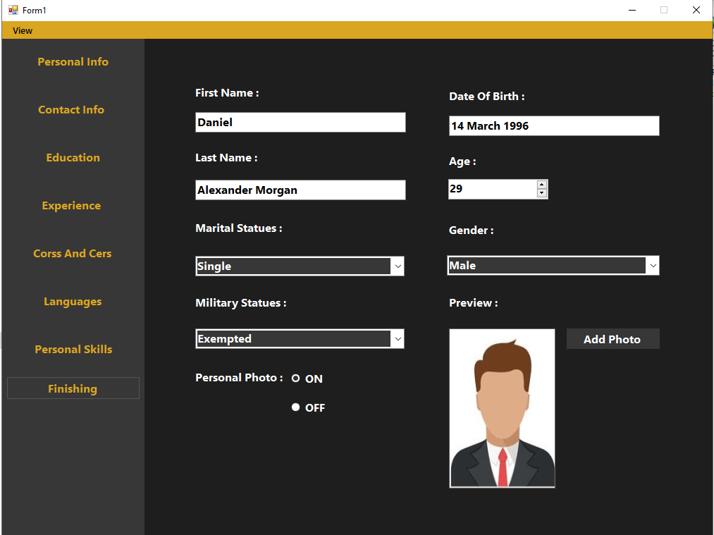
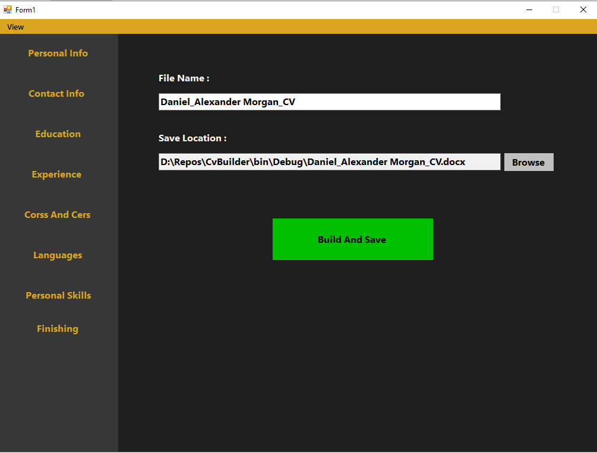
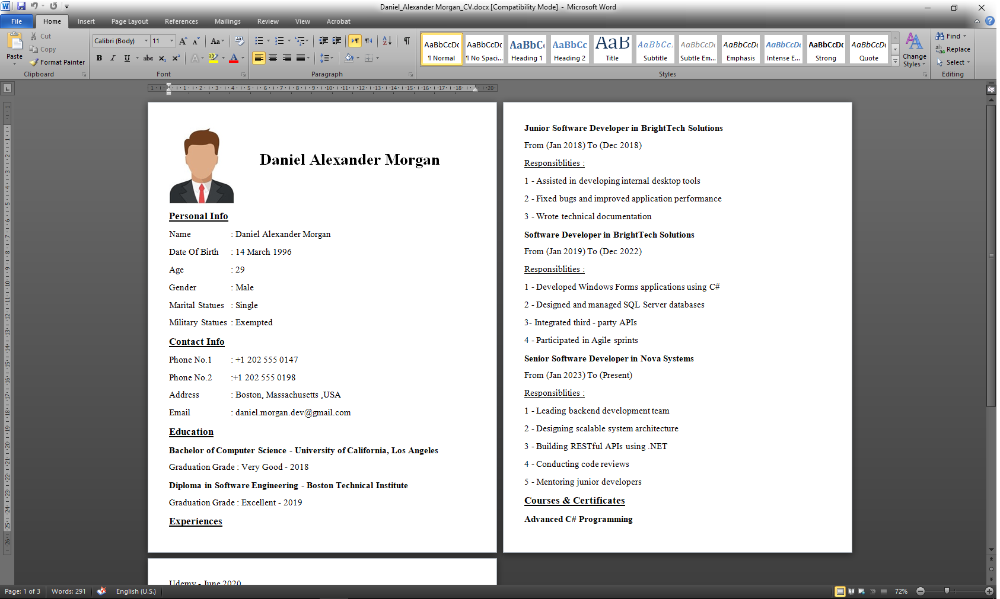

# CvBuilder 🧾

A Windows Forms application built with C# that allows users to create, manage, and export professional CVs (resumes) through a simple and structured interface.

---

## 🚀 Features

* Add personal and contact information
* Manage courses and additional details
* Tab-based UI for better organization
* Generate and export CV to Microsoft Word (.docx)
* Structured data handling using custom classes

---

## 🛠️ Technologies Used

* C# (.NET Framework)
* Windows Forms (WinForms)
* OpenXML SDK (DocumentFormat.OpenXml)

---

## 📸 Application Preview

### 🏠 Home Tab



### 🧩 Build Tab



### 📄 Generated Word Output



---

## 📦 How to Run

1. Clone the repository:

   ```bash
   git clone https://github.com/EzDevX/CvBuilder.git
   ```

2. Open the solution file:

   ```
   CvBuilder.sln
   ```

3. Run the project using Visual Studio

---

## 💡 Future Improvements

* Export to PDF
* Add multiple CV templates
* Improve UI/UX design
* Add Arabic / English language support (RTL support)
* Add validation for user input
* Image handling and optimization

---

## 🧠 Project Structure

* **Core Logic** → Handles CV data and processing
* **WinForms UI** → User interface and interaction
* **Word Exporter** → Generates `.docx` files using OpenXML

---

## 👨‍💻 Author

EzDevX
